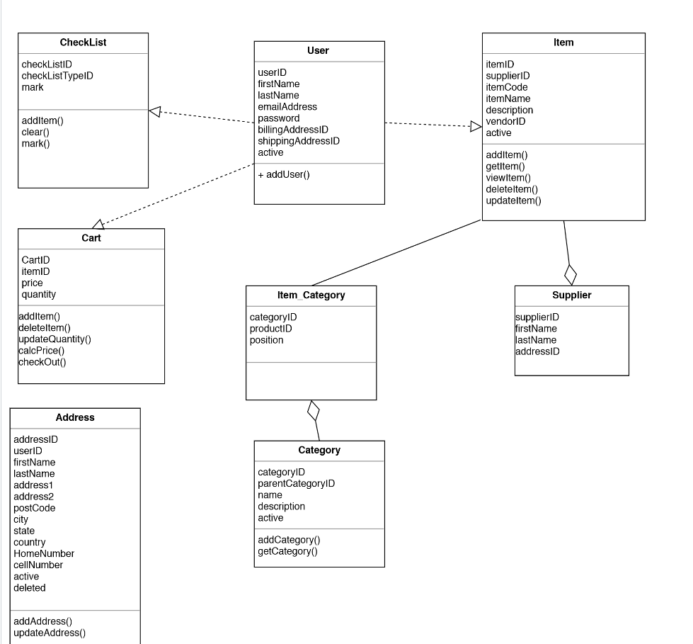
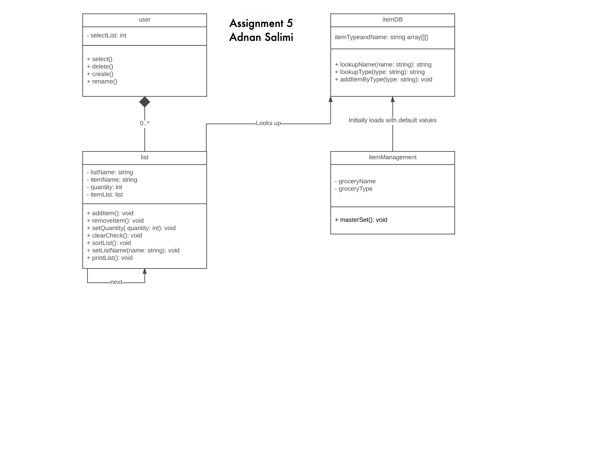

# Design Discussion

## Design 1

 

Lynn's design fulfills the requirements of the application but includes
some inconsistencies and unnecessary classes.

\- The GroceryList should be a managing class for the lists and contains no attributes. 
\- The HierarchicalList class is unnecessary since sorting is not part of the design. 
\- The Database should not be part of the design as it describes a back end implementation. 

\+ All of the requirements are addressed. 
\+ The extra methods included in the List and Item classes help in the team discussion to finalize the group design.

## Design 2

Mark's design fulfills the requirements of the application with minor
design flaws. 

\- Some relationships were not implemented correctly. 
\- The constructors and some attributes in GroceryList and ListHolder were contradicting.

\+ All the requirements are addressed. 
\+ GroceryItemType class eliminates repetition of the type attribute. 
\+ Quantity is set directly in the GroceryItem class. 

## Design 3

Sean's design fulfills all the requirements of the application with 
more classes than necessary.

\- The User class should be considered as a List managment class. 
\- The User class should not be connected with the Items in any way, only the List class. 
\- Some relationships between classes were not implemented correctly.

\+ All the requirements are addressed. 
\+ Catalog eliminates repetition of the type attribute. 

## Design 4

Theofilos' design focuses on minimal design but fails to address some 
requirements.

\- The groupByType and selectItem methods are not implemented. 
\- The ListManager and List classes should have an aggregate relationship. 
\- ItemType should be a separate class to eliminate repetition.

\+ Simple and easy to understand. 
\+ ItemQuantity is implemented in the List class and allowed for an extended discussion of the subject for the final design. 

## Design 5

Shakir's design fulfills all the requirements of the application but includes unnecessary classes.
  
\- The Cart, Address and Supplier does not need to be implemented. 
\- The Database implemention should not be part of the design. 
\- The User class should only manage the list.

\+ All of the requirements are addressed. 
\+ The database style of implemention allowed for an extended discussion of the subject for the final design. 

## Design 6

Adnan's design ...

\- itemManagement class may not have enough functions to function properly. 
\- itemDB may not by able to perform a complex look up. 

\+ Good use of relations to understand how classes work together. 
\+ Uses only necessary classes without having excessive or redundant classes. 

## Team Design

The main focus of our team design was to identify the common aspects of our individual designs and compare the different approaches to better understand the individual strengths and weaknesses of each design. The main common aspect of our final design and the individual one is the existence of a List class, an Item class and a Managing class. This allowed for a common understanding between the team members and their individual designs and made it clear that we are heading the right direction.

With unanimous agreement over these common three classes we were able to focus on the differences in our designs. For the first difference we decided on on, Theofilos' and Lynn's designs had the quantity attribute of items that will be added in a list specified in the List class while Mark and Sean chose to represent the quantity of an item directly in the Item class and have the user only change the quantity from within the List class. Their approach was deemed a more viable approach since the quantity of an Item is an attribute of that item, not of the List.

The second difference was weather the Type of an item should be a separate class or an attribute of the Item class. Theofilos chose to represent it as an attribute, Mark created a separate class only for that type and with a “has-a” relationship to the Item class, Lynn represented the type in the Item class but also involved the database from which the type is stored and Sean created a separate class but with the User class (managing class) having access to that Item type class. To eliminate repetition of the item type in each instance of the Item class, we chose to maintain Mark's approach and create an ItemType class that only contains the type of an item and the quantity of that item in case a specific grocery item type has a quantity associated with it.

The last main difference was to decide whether any other classes were necessary to meet the requirements of the application, Lynn represented a database as well as a hierarchical list both of which were not necessary for the design. Sean created an extra class for items in a list, which we also decided is contradicting to the List class. Theofilos and Mark both had no unnecessary classes and the team agreed that the final design can consists of only four classes to meet the criteria and eliminate any ambiguity.

Lastly, we discussed and agreed on the proper relationships between these four classes to finalize our class diagram and corrected the multiplicities of the relationships.

## Summary

The process of selecting the final design wasn’t easy, as all members of the team had different and valuable input from their perspective designs even though most of our designs were very similar.

The decision to select one design to act as our mainframe helped to narrow the teams vision of the application. The design was chosen by all members of the team based on which design closer resembled a concise and modular approach to the given requirements.

The teamwork for this project allowed the members of the team to showcase their different design approach and opinion on how they envisioned the final product. The constructive criticism among the team elevated the discussion to the direction of learning from our mistakes, better understanding other approaches via comparison with our own and a much better grasp of the concepts involved in a UML class diagram.
