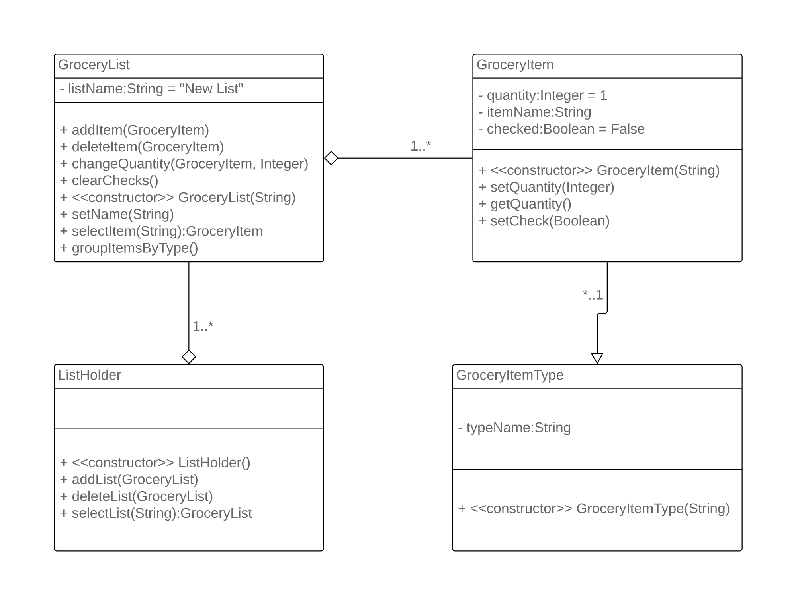
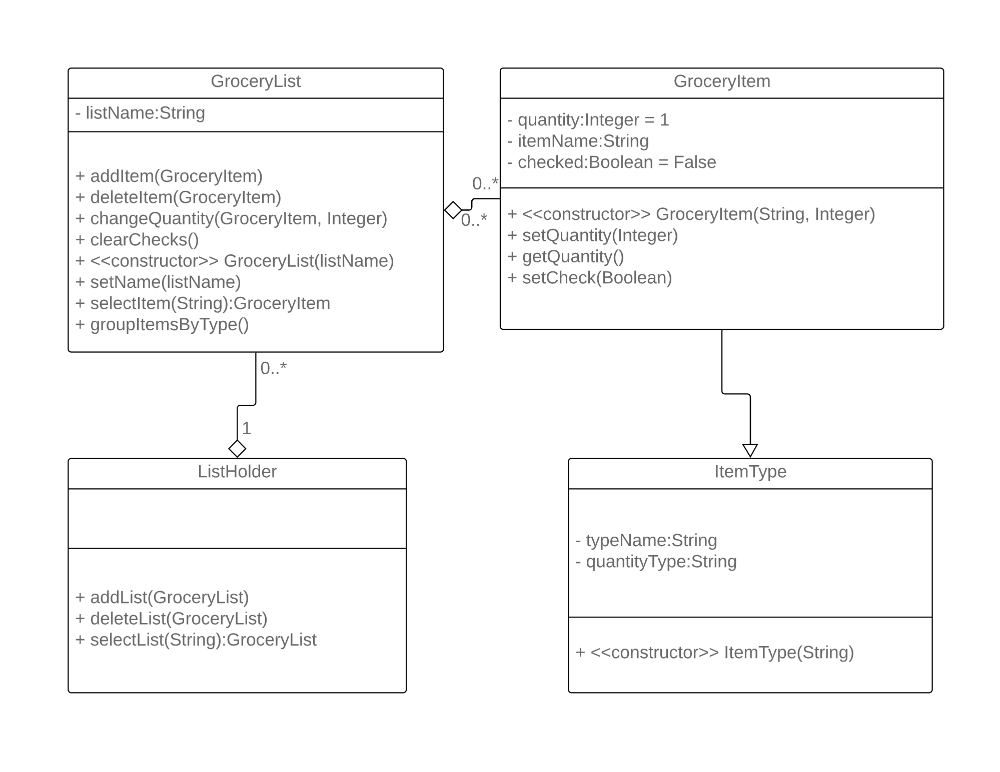

# Design Discussion

## Design 1

 

Lynns design fulfills the requirements of the application but includes
some inconsistencies and unnecessary classes.

>\- The GroceryList should be a managing class for the lists and contains no attributes.
>\- The HierarchicalList class is unnecessary since sorting is not part of the design.
>\- The Database should not be part of the design as it describes a back end implementation.

>\+ All of the requirements are addressed.
>\+ The extra methods included in the List and Item classes help in the team
  discussion to finalize the group design.

## Design 2

Marks design fulfills the requirements of the application with minor
design flaws. 

\- Some relationships were not implemented correctly.
\- The constructors and some attributes in GroceryList and ListHolder were contradicting.

\+ All the requirements are addressed.
\+ GroceryItemType class eliminates repetition of the type attribute.
\+ Quantity is set directly in the GroceryItem class.

## Design 3

Seans design fulfills all the requirements of the application with 
more classes than necessary.

\- The User class should be considered as a List managment class
\- The User class should not be connected with the Items in any way, only the List class.
\- Some relationships between classes were not implemented correctly.

\+ All the requirements are addressed.
\+ Catalog eliminates repetition of the type attribute.

## Design 4

Theofilos design focuses on minimal design but fails to address some 
requirements.

\- The groupByType and selectItem methods are not implemented.
\- The ListManager and List classes should have an aggregate relationship.
\- ItemType should be a separate class to eliminate repetition.

\+ Simple and easy to understand.
\+ ItemQuantity is implemented in the List class and allowed for an extended discussion
  of the subject for the final design.

## Team Design

[discuss the main commonalities and differences between this design and the individual ones, and concisely justify the main design decisions]
 

## Summary

[concisely summarize the lessons learnt in the process of discussing the designs, in terms of design, team work, and any other aspect that you consider relevant]
