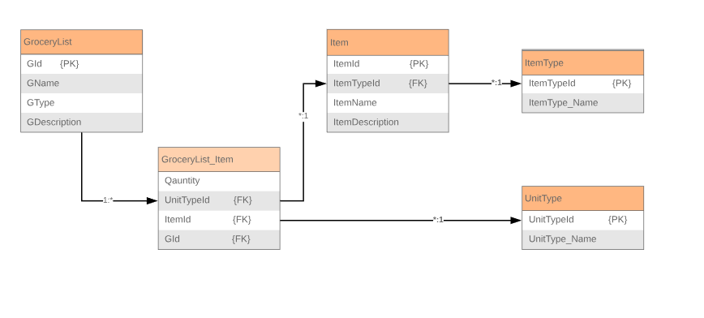

# Design Document

**Author**: Adnan Salimi, Sean Rodriguez. Revised by Mark Abramov.

## 1 Design Considerations

### 1.1 Assumptions

We assume users of this application will be accessing the application with Android devices with Android API 25. The software will be dependent on the Nougat API and may not run optimally on older versions of Android. However, the specs of the application may allow for older devices to use the application without any significant issues. The software will be developed using Java and will implement the SQLite DBMS.

### 1.2 Constraints

The application will not be run on a server-side database. Rather, it will be run using SQLite, which is embedded into the program. This means users will not be able to access the same grocery list across multiple devices.

### 1.3 System Environment

This application will only be developed for Android mobile phone devices (not tablets). The system must be able to operate with a device which is capable of receiving input by touch. The device running the application must have enough RAM to be able to run the application without any issues. In order to have persistent data, the system requires the program to have an embedded SQLite database to store user information, such as lists and items. 

## 2 Architectural Design

### 2.1 Component Diagram

Our system contains four classes which will work together to provide the full functionality of the application. Our system maintains a hierarchy which enables us maintain the functionality of our application without the worry of classes not functioning together. The ListHolder class will contain our lists, while the GroceryList class will define the actual grocery list and its properties. Items will be contained within this list, which will have an associated item type for labeling purposes.

### 2.2 Deployment Diagram

Given the simplicity of the application, our application contains a straightforward design which requires a user interface that displays the ability to create, modify, and view lists. From here, users will then be able to manage their lists and whatever items they may contain. The applications functionality ties to the applications SQLite database, which will allow for persistence as to save the users changes or modifications.

## 3 Low-Level Design

### 3.1 Class Diagram

Our class diagram shows the necessary functions and attributes of the classes required for our system to function as intended. A ListHolder class may contain many GroceryLists. The GroceryList class shares a many-to-many relationship with the item class, as there can be many instances of items in many lists. 

### 3.2 Database Diagram

Our Database diagram shows the necessary tables and their relationships for our database component.

## 4 User Interface Design
The main wireframes for our app are:

[The complete set of mockups for our app can be found here](https://github.com/qc-se-spring2019/370Spring19Team2/tree/master/GroupProject/Docs/Diagrams/Mockup)

