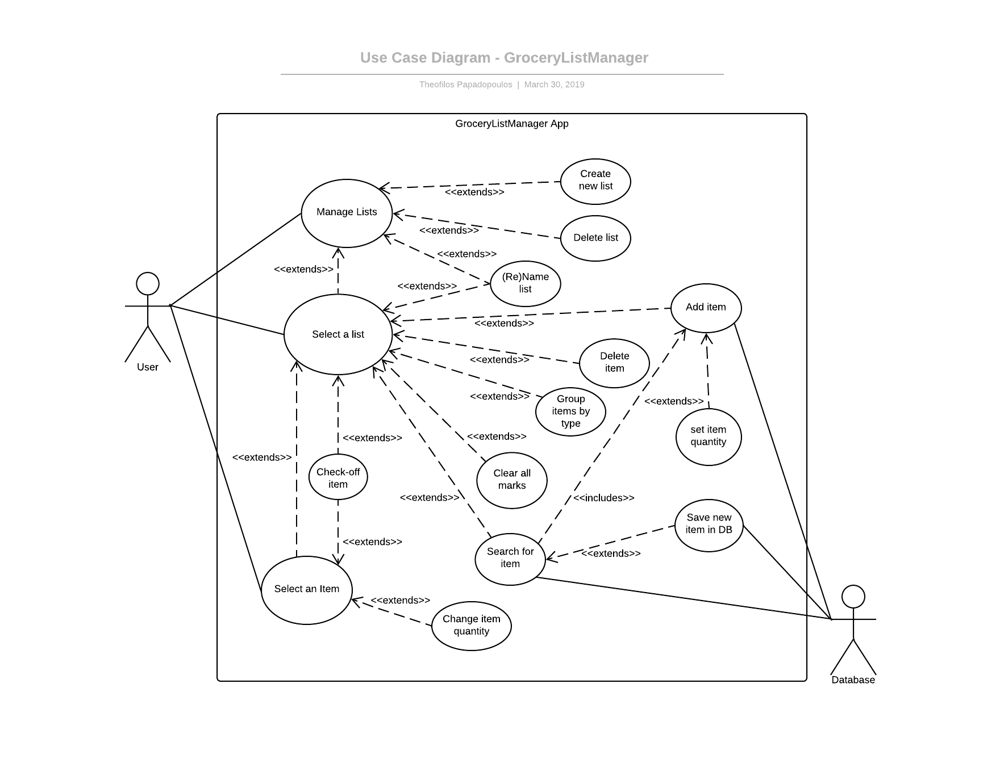

# Use Case Model

**Author**: Theofilos Papadopoulos

## Use Case Diagram

 

## Use Case Descriptions

### Use case #1 
-	*Actor:* User.
-	*Requirement:* Allow User to create a new list.
-	*Pre-condition:* The User started the application with no errors.
-	*Post-condition:* A new list will appear on the home screen.
-	*Scenario:* When the User wants to create a new list, they will select the “create a new list” action on the home screen of the application. This action will result in a new list to be generated at the home screen of the application.
### Use case #2
-	*Actor:* User.
-	*Requirement:* Allow User to name or rename a list.
-	*Pre-condition:* The User started the application with no errors and created at least one list.
-	*Post-condition:* The selected list will appear on the home screen with a new name.
-	*Scenario:* When the User wants to name (or rename) a list, they will tap on the list they wish to name and select the “rename list” action on the home screen of the application. This action will allow the User to type a new name for the selected list. Once the new name has been typed the User will tap on the “finish” option and the selected list will be displayed with the new name typed by the User on the home screen of the application.
### Use case #3
-	*Actor:* User.
-	*Requirement:* Allow User to delete a list.
-	*Pre-condition:* The User started the application with no errors and created at least one list.
-	*Post-condition:* The selected list will no longer appear on the home screen of the application.
-	*Scenario:* When the User wants to delete a list, they will tap on the list they wish to delete and select the “delete list” action on the home screen of the application. This action will result in the selected list to be deleted from the home screen of the application.
### Use case #4
-	*Actors:* User, Database.
-	*Requirement:* Allow User to add an item in a list.
-	*Pre-condition:* The User started the application with no errors, the User has selected a list and the item exists in the database.
-	*Post-condition:* A new item will appear on the selected list with some quantity.
-	*Scenario:* When the User wants to add a new item in a list, they can either search for the item or directly select it from a hierarchical list. Both methods will reference the Database for the item name and the item type. Once the item has been selected the User can change the quantity of the item before they add it to the list, or they can select the “add item” action immediately which will add the item to the list with a default quantity. The default quantity of an item will be based on the type of that item.

### Use case #5
-	*Actor:* User, Database.
-	*Requirement:* Allow User to save a new item in the database.
-	*Pre-condition:* The User started the application with no errors, the User has selected a list and the item does not exist in the Database.
-	*Post-condition:* A new item will be stored in the Database for future reference.
-	*Scenario:* When the User wants to add a new item in a list but that item does not exist in the Database, they will be given the option to store this item in the database for future reference. The User will then enter the name of the item as well as the type of that item and select “Save new item in DB”. The user can then continue to add this item in the selected list.
### Use case #6
-	*Actor:* User.
-	*Requirement:* Allow User to delete an item from a list.
-	*Pre-condition:* The User started the application with no errors, the User has selected a list and the item is already on the list.
-	*Post-condition:* An item that was on a list will no longer be there.
-	*Scenario:* When the User wants delete an item from a selected list, they will tap on the item in the list and select the “delete item” action. This action will result in the selected item to be removed from the list.
### Use case #7
-	*Actor:* User.
-	*Requirement:* Allow User to group items in a list by their types.
-	*Pre-condition:* The User started the application with no errors, the User has selected a list and the list contains some items.
-	*Post-condition:* All items in the selected list will be displayed in groups based on their type.
-	*Scenario:* When the User wants group the items on a list, they will select the “group by type” action. This action will result in all items in the selected list to appear in groups each with a given item type.

### Use case #8
-	*Actor:* User.
-	*Requirement:* Allow User to clear all check-off marks.
-	*Pre-condition:* The User started the application with no errors, the User has selected a list and the list contains some checked-off items.
-	*Post-condition:* All checked-off marks will be cleared.
-	*Scenario:* When the User wants to clear all the checked-off marks from the items they checked-off, they will select the “clear all marks” action. This action will result in all the checked marks to be cleared from all the items in the list at once.

### Use case #9
-	*Actor:* User.
-	*Requirement:* Allow User to check-off items in a selected list.
-	*Pre-condition:* The User started the application with no errors, the User has selected a list and the list contains at least one item.
-	*Post-condition:* The selected item will appear with a check mark next to it.
-	*Scenario:* When the User wants to check an item in the list they can either directly check it off from the list by tapping on the “check box” next to the item, or they can check it off by tapping the “check box” after the item has been selected. Either step will result in the item to appear with a check mark next to it on the selected list.

### Use case #10
-	*Actor:* User.
-	*Requirement:* Allow User to change the quantity of an item on a selected list.
-	*Pre-condition:* The User started the application with no errors, the User has selected a list and at least one item appears on the list.
-	*Post-condition:* The selected item will appear with a new quantity value on the list.
-	*Scenario:* When the User wants to change the quantity of an item, they will select the item they want to edit and tap on the “change item quantity” action. The User can then type the new amount for that item and tap on “finish” for the change to occur. This action will result in the item to appear with the new quantity value on the list.
